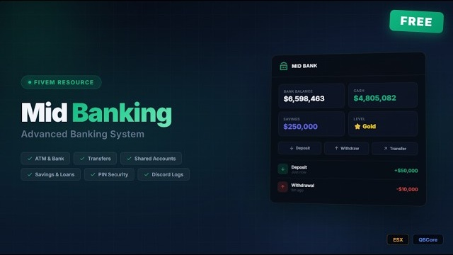

# mid-banking

Free banking resource for FiveM, supports ESX and QBCore.

## Preview

[Watch on YouTube](https://youtu.be/7hyB37aZNeQ)

## Features
- Full bank UI (dark theme, animations)
- ATM with CRT screen effect
- PIN with lockout protection
- Transfers between players
- Shared accounts (up to 6 members, roles)
- Savings with interest
- Loans
- Transaction history + filtering
- Weekly chart
- Account levels (Bronze-Diamond)
- Discord logging

## Requirements
- [oxmysql](https://github.com/overextended/oxmysql)
- [ox_lib](https://github.com/overextended/ox_lib)
- [ox_target](https://github.com/overextended/ox_target) or [qb-target](https://github.com/qbcore-framework/qb-target)
- ESX or QBCore

## Setup
1. Put `mid-banking` in your resources folder
2. Run `install.sql` in your database
3. Add `ensure mid-banking` to server.cfg (after framework + deps)
4. Edit `config.lua` to your liking

All settings are in `config.lua`.

## Author
mid - [YouTube](https://youtu.be/7hyB37aZNeQ) · [Discord](https://discord.gg/X2zBWC7hY4)
